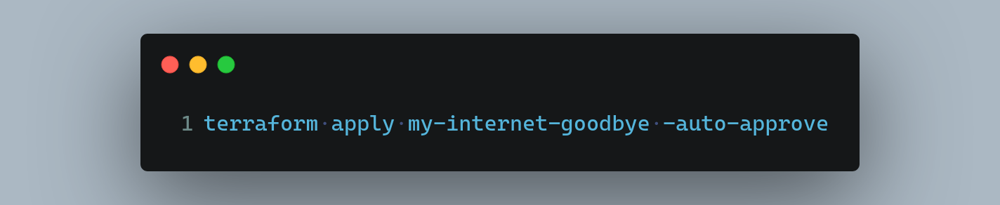
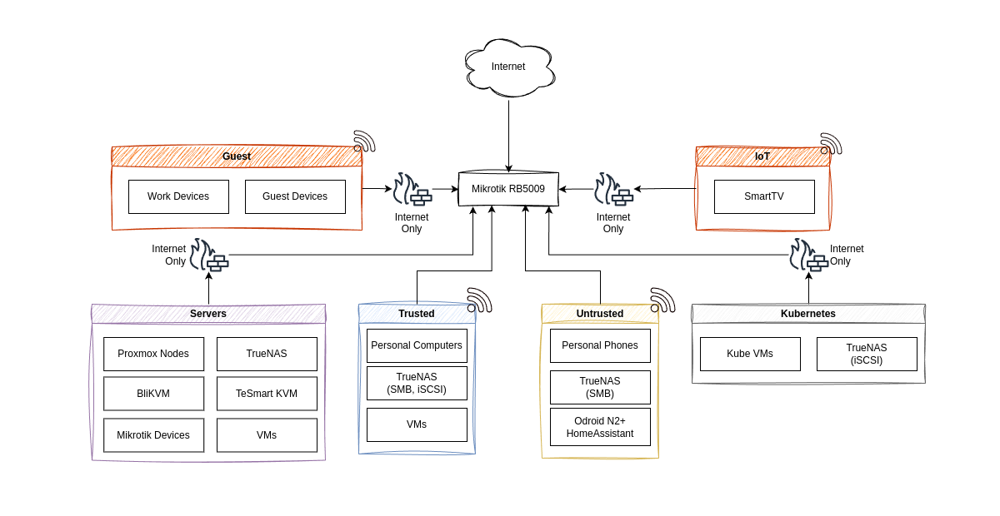

# Mikrotik - Terraform



This repository contains Terraform automation for my entire Mikrotik-powered home network. The purpose of this repository is to provide a structured and repeatable way to manage and automate the setup of my MikroTik devices using Infrastructure as Code (IaC) principles.

## Why Terraform for Network Infrastructure?

Fundamentally speaking, there is nothing that sets this approach apart from, say, a configuration script or just backing up and importing the configuration on the device. Yet, I still decided to use Terraform for this. Why?

1. **I'm weird like that**: As someone who works in DevOps as my main gig, manual configurations (or ClickOps, as we also call it 😉), makes me cringe and I avoid it like the plague. I like defining configuration as code whenever possible since it makes it easy to reproduce and tweak this system.

2. **Skill ~~Issue~~Development**: Working on this project provides a practical, hands-on opportunity to explore advanced Terraform features and patterns. Not to mention that breaking something takes my entire internet away until I fix it, and fixing it without internet may be tricker than you think. This forces me to think more carefully about the configuration before applying.

3. **Because I can**: Not everything in life has to have a good reason. Sometimes reinventing the wheel just to learn or doing things for the heck of it are valid reasons.

## Network Overview



This project provides automated deployment and management for the following devices in my infrastructure:

- **RB5009 router** -> main router + firewall + CAPSMAN server
- **cAP AX Access Point** -> provisioned via CAPSMAN
- **CRS326 switch** -> Main Rack Switch
- **Hex switch** -> Living Room Switch (no AP functionality used here)

I was initially planning to also add some more details about my network, like VLAN setup and wireless networks and whatnot, but then I realised I can't really be bothered to also update those whenever I change something, so if you're curious, feel free to look at the code!

## Project Structure

```bash
├── .github/   # GitHub workflow configurations and automation
├── modules
│   ├── base        # Base configuration for all devices
│   └── dhcp-server # DHCP server configuration
├── .sops.yaml      # SOPS configuration
├── credentials.auto.tfvars.sops # SOPS encrypted tfvars file
├── mise.toml       # tool configuration + dev tasks
├── main.tf         # Provider configuration + Local variables
├── router-*.tf               # RB5009 router configurations
├── switch-*.tf               # Switch device configuration
├── terraform.tfstate.sops    # SOPS-encrypted TF state file
└── variables.tf              # Terraform input variables
```

## Getting Started

### Requirements

- [Terraform](https://www.terraform.io/) (duh!)
- [mise](https://mise.jdx.dev/) for managing dependencies and running tasks
- [SOPS](https://github.com/getsops/sops) for secrets management
- [age](https://github.com/FiloSottile/age) for encryption

### Initial Device Setup

Before applying Terraform configurations, new Mikrotik devices need minimal setup to enable Terraform management. I will not go into details here, but I did write a [blog post](https://mirceanton.com/posts/mikrotik-terraform-getting-started/) about it in which you can learn more.

### Secrets Management

This project uses SOPS with age for encryption of sensitive data:

1. **Setup environment**:

   ```bash
   mise install
   ```

2. **Decrypt secrets** (requires access to the age key):

   ```bash
   mise run decrypt
   ```

3. **After making changes, encrypt secrets**:

   ```bash
   mise run encrypt
   ```

### Applying Terraform Configuration

1. **Initialize Terraform**: `terraform init`
2. **Decrypt secrets**: `mise run decrypt`
3. **Plan** (and review) **changes**: `mise run plan`
4. **Apply changes**: `terraform apply`
5. **Re-encrypt secrets** (state file, mainly): `mise run encrypt`

## Limitations

While this project aims to provide comprehensive automation for Mikrotik devices, there are some limitations:

- Initial setup still requires manual configuration before Terraform can be applied
- Complex configurations sometimes require a multi-step approach rather than a single `apply`
- The risk of cutting yourself off of the internet may be low... but it's never zero. Ask me how I know! 😉
- Prepare to get close and intimate with `terraform state mv` if you plan to rename or move objects around. Very few things are stateless, so they can't be deleted and recreated generally.

## Sharing & Risks

By publishing this repository, I accept the risk of exposing aspects of my home network topology. Storing the state and tfvars in git, albeit encrypted, doesn't help much in this regard either! 😅  
While I've taken **some** steps to ensure sensitive information is managed securely, sharing this code inherently comes with certain risks.

All that being said, I ultimately decided to open-source this code and publish it for 2 main reasons:

1. I believe that sharing knowledge is valuable to the community. As I have learned from others, so shall others be able to learn from me. Such is the cycle.
2. I truly believe this was an interesting project. I hope that seeing this will inspire others to attempt similar projects and in turn also share their experiences.

## License

This project is licensed under the MIT License - see the [LICENSE](LICENSE) file for details.
