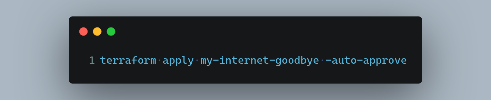

# Mikrotik - Terraform



Terragrunt-managed [OpenTofu](https://opentofu.org/) automation for my entire MikroTik-powered home network. Devices, DNS records, and supporting OVH glue are all defined as code, planned and applied via local terragrunt with an S3-compatible remote state.

## Why Terraform for Network Infrastructure?

1. **I'm weird like that** — DevOps as day job; ClickOps makes me cringe. Config as code is reproducible and tweakable.
2. **Skill ~~Issue~~Development** — terraform/terragrunt patterns get real exercise here. Breaking it cuts my internet, so I think before I apply.
3. **Because I can** — sometimes reinventing the wheel to learn is reason enough.

## Network Overview

Devices currently managed:

- **RB5009 router** — main router + firewall + CAPSMAN server (local site)
- **CRS326 switch** — main rack switch
- **wAP AX AP** — provisioned via CAPSMAN
- **HEX router** — offsite site router

DNS / supporting:

- **OVH** — CNAME records for IPv4 and VPN endpoints

## Project Structure

```text
.
├── .forgejo/workflows/      # CI: lint + terraform fan-out to dotrepos leaves
├── docs/img/                # README image assets
├── infrastructure/          # Terragrunt root configs (per device / per record)
│   ├── mikrotik/
│   │   ├── locals.hcl              # shared locals for local-site routers
│   │   ├── offsite-locals.hcl      # shared locals for offsite-site routers
│   │   ├── router-base/            # RB5009 local base config
│   │   ├── router-services/        # RB5009 local services (DHCP, DNS, etc.)
│   │   ├── router-offsite/         # RB5009 offsite base
│   │   ├── router-offsite-services/# RB5009 offsite services
│   │   └── switch-crs326/          # CRS326 switch config
│   └── ovh/
│       ├── dependency.hcl          # shared OVH provider/auth
│       ├── ipv4-cname/             # public IPv4 CNAME
│       └── vpn-cname/              # VPN endpoint CNAME
├── modules/                 # Reusable OpenTofu modules
│   ├── mikrotik-base/              # bonding, bridge, VLANs, BGP, NTP, certs, …
│   ├── mikrotik-router-services/   # local-site router services
│   ├── mikrotik-offsite-services/  # offsite-site router services
│   └── ovh-cname/                  # OVH CNAME wrapper
├── scripts/plan-filter.sh   # filters noisy terragrunt plan output
├── .env                     # local secrets (gitignored, populated by `just env`)
├── .mise.toml               # tool pinning (opentofu, terragrunt, just, linters)
├── .lefthook.toml           # pre-commit hooks (dotrepos remote + tofu/terragrunt fmt)
├── commitlint.config.js     # conventional-commit rules
├── justfile                 # task runner: env / plan / apply / clean
├── root.hcl                 # terragrunt remote_state config (S3-compatible)
└── .terraform.lock.hcl      # provider version pinning
```

## Workflow

### 1. Bootstrap secrets

Secrets live in [Infisical](https://infisical.com) under `/mikrotik`. Populate local `.env`:

```bash
just env
```

This pulls the live secret set and writes `.env` (gitignored). `direnv` auto-loads it on `cd`.

### 2. Plan

```bash
just plan         # all modules, summarised output via scripts/plan-filter.sh
just plan-full    # all modules, full terragrunt output
just plan-local   # only router-base, router-services, switch-crs326
just plan-path infrastructure/mikrotik/router-base   # specific module
```

### 3. Apply

```bash
just apply        # all modules
just apply-local  # only local-site bundle
just apply-path infrastructure/mikrotik/router-base
```

### 4. Maintenance

```bash
just init         # terragrunt init --all
just clean        # nuke .terragrunt-cache directories
```

## Remote State

`root.hcl` configures the terragrunt `remote_state` to an S3-compatible endpoint (`api.s3.vzkn.eu`, bucket `tfstate-mikrotik-terraform`). State keys mirror the path under `infrastructure/`. Credentials come from `.env` (`AWS_ACCESS_KEY_ID`, `AWS_SECRET_ACCESS_KEY`).

## Limitations

- Initial device setup (admin user, terraform user, SSH access) is still manual — terraform takes over from the point provider auth works.
- Some changes need a multi-step apply (e.g. interface rename → bridge re-add).
- Cutting yourself off the internet with a bad plan is *unlikely* but *not zero*. Ask me how I know.
- `terraform state mv` is your friend when you reorganize — almost nothing here is stateless.

## Sharing & Risks

Publishing this exposes parts of my home network topology. Tfstate is in a private S3 bucket, secrets in Infisical, `.tfvars` gitignored. The code itself is open because:

1. Sharing what I learned is the same loop I learned from.
2. It's an interesting project and I hope someone reading it builds their own.

## License

MIT — derived from [mirceanton/mikrotik-terraform](https://github.com/mirceanton/mikrotik-terraform). See [LICENSE](LICENSE).

## Inspiration & Credits

Originally inspired by [mirceanton/mikrotik-terraform](https://github.com/mirceanton/mikrotik-terraform). The codebase has diverged significantly to fit my own infra, but the initial layout and module split are owed to that work.
